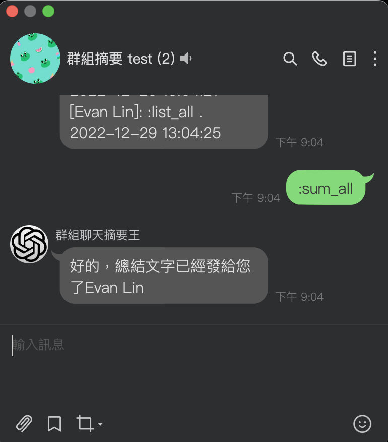
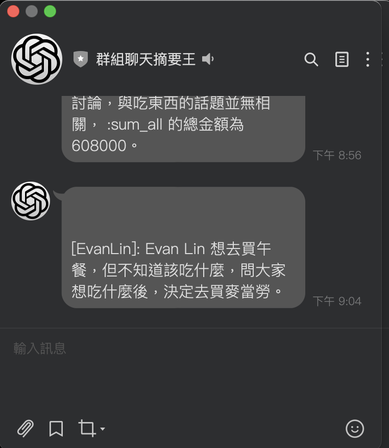

LINE Bot 聊天摘要生成器：使用 ChatGPT 將你的群聊作為聊天摘要生成器，與 LINE Bot 聊天摘要生成器一起使用
==============

    

English version, please check [ENGLISH Version](README_en.md)

使用方式
=============

- 依照「如何安裝」進行相關的部署流程。

- 將機器人加入群組聊天室。

- 能夠記住群組內的對話。
  

- 直接送群組內容摘要私訊給你。

### 相關指令如下

- `:gpt xxx`: 直接對 ChatGPT 來對談，可以直接問他。

- `:draw xxx`: 請他根據你輸入的文字來畫圖給你。

- `:list_all`: 列出群組的訊息紀錄（all)

- `:sum_all`: 幫你做訊息摘要。

### 相關限制

目前該 LINE Bot 原始程式碼還沒有綁定相關資料庫，所以都是使用記憶體來儲存相關對話紀錄。可能重開機（隔天）會有忘記的，或是超過就無法儲存的缺點。

如何安裝
=============

### 獲取 LINE Bot API 開發者帳戶

如果你想使用 LINE Bot，請確保在 <https://developers.line.biz/console/> 註冊 LINE 開發者控制台。

在「基本設定」選項卡上創建新的消息通道並獲取「Channel Secret」。

在「Messiging API」選項卡上獲取「Channel Access Token」。

從「基本設定」選項卡中打開 LINE OA 管理器，然後轉到 OA 管理器的回復設定。在那裡啟用「webhook」。

### 獲取 OpenAI API Token

在 <https://openai.com/api/> 註冊帳戶。

一旦你有了帳戶，就可以在帳戶設定頁面找到你的 API Access Token。

如果你想在開發中使用 OpenAI API，你可以在 API 文檔頁面中找到更多信息和說明。

請注意，OpenAI API 只面向滿足某些條件的用戶開放。你可以在 API 文件頁面中找到有關 API 的使用條件和限制的更多信息。

### 部署在不同的 Web Platform

你可以選擇部署在 [Heroku](https://www.heroku.com/) 或是 [Render](http://render.com/)

#### 部署在 Heroku

- 輸入 `Channel Secret` and `Channel Access Token` 還有 `ChatGptToken` .

#### 部署在 Rener

- 輸入 `Channel Secret` and `Channel Access Token` 還有 `ChatGptToken` .

### 部署不同資料庫

### PostGresSQL

請記得在參數裡面加上 `DATABASE_URL` DB 的連接網址。
如果留空的話，將會使用記憶體當資料庫。

### 接下來

記住你的 Web Platform  伺服器 ID。

在 LINE Bot 儀表板中設置基本 API：

設置你的基本帳戶信息，包括「Webhook URL」在 <https://{YOUR_HEROKU_SERVER_ID}.herokuapp.com/callback>。

這就是它！你完成了。

License
---------------

Licensed under the Apache License, Version 2.0 (the "License");
you may not use this file except in compliance with the License.
You may obtain a copy of the License at

<http://www.apache.org/licenses/LICENSE-2.0>

Unless required by applicable law or agreed to in writing, software
distributed under the License is distributed on an "AS IS" BASIS,
WITHOUT WARRANTIES OR CONDITIONS OF ANY KIND, either express or implied.
See the License for the specific language governing permissions and
limitations under the License.

func handleSumAll(event *linebot.Event) {
    // Scroll through all the messages in the chat group (in chronological order).
    oriContext := ""
    q := summaryQueue.ReadGroupInfo(getGroupID(event))
    for _, m := range q {
        // [xxx]: 他講了什麼... 時間
        oriContext = oriContext + fmt.Sprintf("[%s]: %s . %s\n", m.UserName, m.MsgText, m.Time.Local().UTC().Format("2006-01-02 15:04:05"))
    }

    // 将系统消息添加到 oriContext 中
    systemMessage := "下面的許多訊息是一個排班工作的交換工作時間群組，內容會包含想換班的時間日期、上班時間等資訊，雖然包含許多特定的名詞，但沒關係。請嘗試依照這種範例方式整理資料:10/23（一）[範例姓名]想要换早班\n[範例姓名]13B想換晚班\n\n10/24（二）\n[範例姓名]15A想要換晚班。（範例請勿加到回覆內容中）（內容一定會包含日期、姓名，請協助格式整理。一個訊息中常包含多個日期，請將日期分開）如果你看不懂資料，請列在最後面，不要嘗試修改或捏造。資料請依照日期先後排序"

    // 使用 chatgpt.go 裡面的 ChatGPT 处理 oriContext，同时传递 systemMessage
    reply, err := gptChat(oriContext, systemMessage)
    if err != nil {
        fmt.Printf("ChatGPT error: %v\n", err)
        // 處理錯誤
        return
    }

    // 因为 ChatGPT 可能会很慢，所以这边后来用 SendMsg 来发送私訊给用户。
    _, _ = bot.PushMessage(event.Source.UserID, linebot.NewTextMessage(reply)).Do()
}

func gptChat(ori string, systemMessage string) (ret string, err error) {
    // Get the context.
    ctx := context.Background()

    // Create a slice of ChatCompletionMessage to construct the conversation.
    conversation := []openai.ChatCompletionMessage{
        {
            Role:    openai.ChatMessageRoleSystem,
            Content: systemMessage,
        },
        {
            Role:    openai.ChatMessageRoleUser,
            Content: ori,
        },
    }

    // Create a ChatCompletionRequest using the conversation.
    req := openai.ChatCompletionRequest{
        Model:    "gpt-3.5-turbo-16k-0613",
        Messages: conversation,
    }

    resp, err := client.CreateChatCompletion(ctx, req)
    if err != nil {
        return "", err
    }

    // Extract the content from the response.
    ret = resp.Choices[0].Message.Content
    return ret, nil
}

